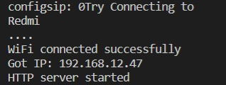

# Práctica 3a

El objetivo de la práctica és comprender el funcionamiento de WIFI.


## Código:
```
#include <WiFi.h>
#include <WebServer.h>
 
void handle_root();
// SSID & Password
const char* ssid = "Xiaomi_11T_Pro"; // Enter your SSID here
const char* password = "f5cbd8a82232"; //Enter your Password here
WebServer server(80); // Object of WebServer(HTTP port, 80 is defult)
 
void setup() {
    Serial.begin(115200);
    Serial.println("Try Connecting to ");
    Serial.println(ssid);
// Connect to your wi-fi modem
    WiFi.begin(ssid, password);
// Check wi-fi is connected to wi-fi network
    while (WiFi.status() != WL_CONNECTED) {
        delay(1000);
        Serial.print(".");
    }
    Serial.println("");
    Serial.println("WiFi connected successfully");
    Serial.print("Got IP: ");
    Serial.println(WiFi.localIP()); //Show ESP32 IP on serial
    server.on("/", handle_root);
    server.begin();
    Serial.println("HTTP server started");
    delay(100);
}
void loop() {
    server.handleClient();
}
// HTML & CSS contents which display on web server
String HTML = "<!DOCTYPE html>\
<html>\
<body>\
<h1>Aquesta es la meva primera pagina web - Station Mode &#128522;</h1>\
</body>\
</html>";
// Handle root url (/)
void handle_root() {
server.send(200, "text/html", HTML);
}
```
## Funcionamiento:

Es un programa que crea una pagina web, se hace conectando la placa a una red wifi (en clase fue un movil que estaba compartiendo wifi).

El programa avisa si se ha conectado o no. Después de haberse conectado hay que crear el contenido de nuestra página web. 

Cuando este funcionando el programa y hayamos creado nuestra página web saldrà por pantalla la IP de esta web. Solo habrá que poner la dirección IP en el buscador que utilicemos para llegar a nuestra pagina web.





___

## Página 2:
```
#include <WiFi.h>
#include <WebServer.h>
 
void handle_root();
// SSID & Password
const char* ssid = "Xiaomi_11T_Pro"; // Enter your SSID here
const char* password = "f5cbd8a82232"; //Enter your Password here
WebServer server(80); // Object of WebServer(HTTP port, 80 is defult)
 
void setup() {
    Serial.begin(115200);
    Serial.println("Try Connecting to ");
    Serial.println(ssid);
// Connect to your wi-fi modem
    WiFi.begin(ssid, password);
// Check wi-fi is connected to wi-fi network
    while (WiFi.status() != WL_CONNECTED) {
        delay(1000);
        Serial.print(".");
    }
    Serial.println("");
    Serial.println("WiFi connected successfully");
    Serial.print("Got IP: ");
    Serial.println(WiFi.localIP()); //Show ESP32 IP on serial
    server.on("/", handle_root);
    server.begin();
    Serial.println("HTTP server started");
    delay(100);
}
void loop() {
    server.handleClient();
}
// HTML & CSS contents which display on web server
String HTML = "<!DOCTYPE html>\
<html>\
<body>\
<h1>Excursiones del Vallés Occidental: - Station Mode &#128522;</h1>\
<p> - 1. LA MOLA. LA RUTA MÁS CLÁSICA DEL VALLÈS OCCIDENTAL
<p> - 2. EL MONTCAU. OTRA RUTA MUY CONOCIDA DEL VALLÈS OCCIDENTAL
<p> - 3. PINS CARGOLATS
<p> - 4. LES FORADADES. UNA LUGAR MUY CURIOSO DEL VALLÈS OCCIDENTAL
<p> - 5. TORRENT DE COLOBRERS, SABADELL – VALLÈS OCCIDENTAL
<p> - 6. COVES DE SIMANYA
<p> - 7. PUIG DE LA CREU. UNA ASCENSIÓN SENCILLA DEL VALLÈS OCCIDENTAL
<p> - 8. CASTELLSAPERA
</body>\
</html>";
// Handle root url (/)
void handle_root() {
server.send(200, "text/html", HTML);
}
```

He modificado el código de la web con lenguaje html y he creado una nueva web donde pone el nombre de excursiones famosas del Vallés Occidental. 


